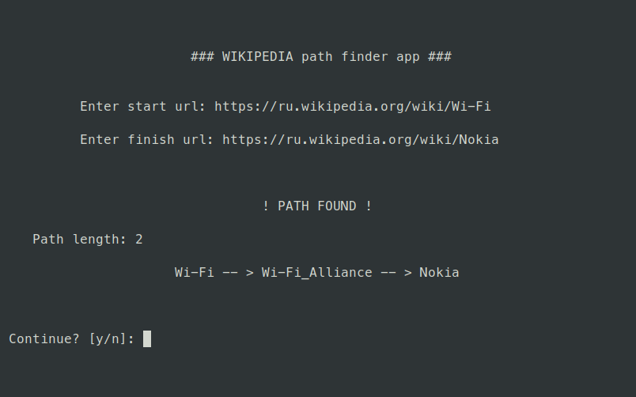

### Wikipedia path finder

#### Install dependences
```
pip install -r server/requirements.txt
```

#### Start server
```
docker-compose up
```

#### Start client
```
python3.8 client/client.py
```

#### Example

